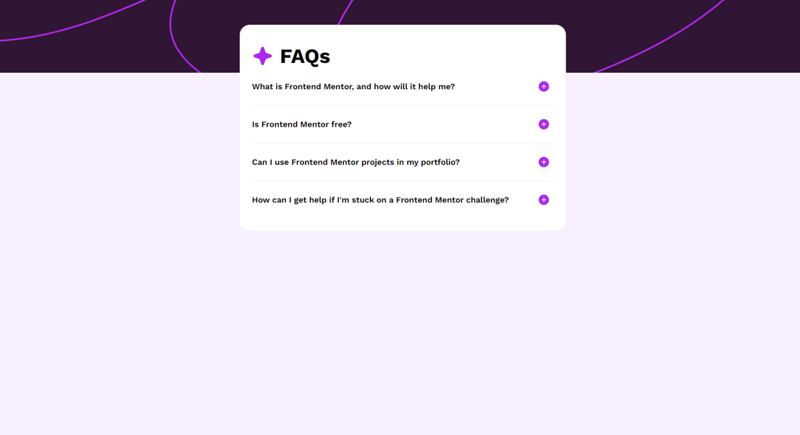
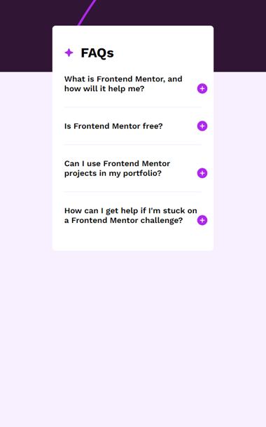

# Frontend Mentor - FAQ accordion solution

This is a solution to the [FAQ accordion challenge on Frontend Mentor](https://www.frontendmentor.io/challenges/faq-accordion-wyfFdeBwBz). Frontend Mentor challenges help you improve your coding skills by building realistic projects. 

## Table of contents

- [Overview](#overview)
  - [The challenge](#the-challenge)
  - [Screenshot](#screenshot)
  - [Links](#links)
- [My process](#my-process)
  - [Built with](#built-with)
  - [Thoughts](#thoughts)
- [Author](#author)

## Overview

### The challenge

Users should be able to:

- Hide/Show the answer to a question when the question is clicked
- Navigate the questions and hide/show answers using keyboard navigation alone
- View the optimal layout for the interface depending on their device's screen size
- See hover and focus states for all interactive elements on the page

### Screenshot

### Links

[Solution URL](https://parsaltem.github.io/Faq-Accordion/){:target="_blank" rel="noopener"}

## My process

### Built with

- Semantic HTML5 markup
- CSS custom properties
- Flexbox
- CSS Grid
- Javascript
- Mobile-first workflow

### Thoughts

This was the my first project using JS. I tried to keep it simple to read. First I created JS head and text objects within an data array. Then create HTML document. I did really enjoy while creating all documents. I hope you do too.

I may update this solution in the future, until then, this element is an interesting thing to note, at least.

## Author

- Frontend Mentor - [@Parsaltem](https://www.frontendmentor.io/profile/Parsaltem)